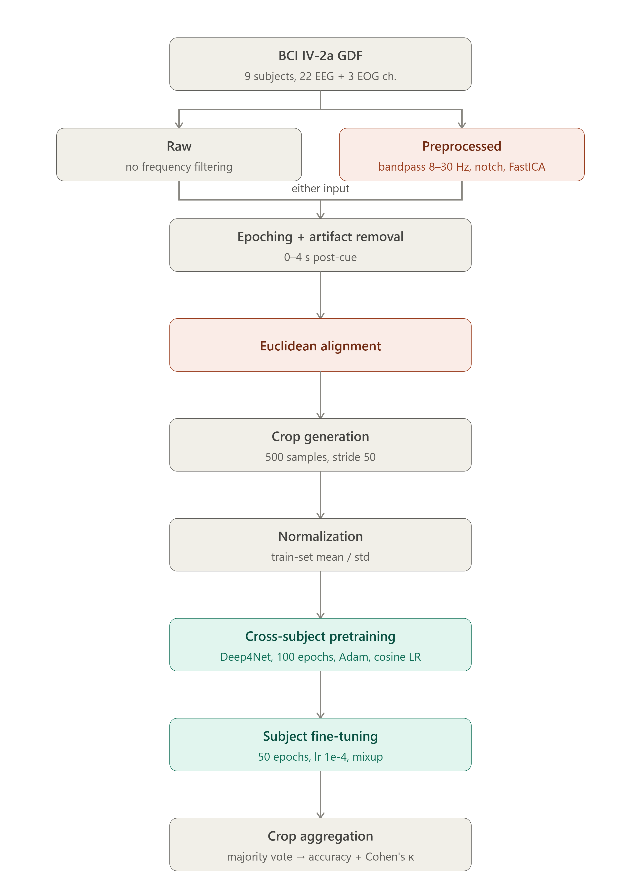
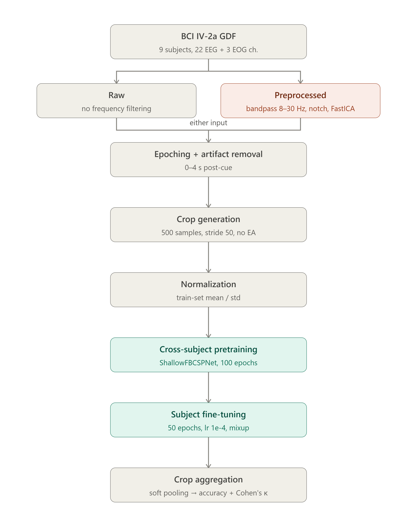
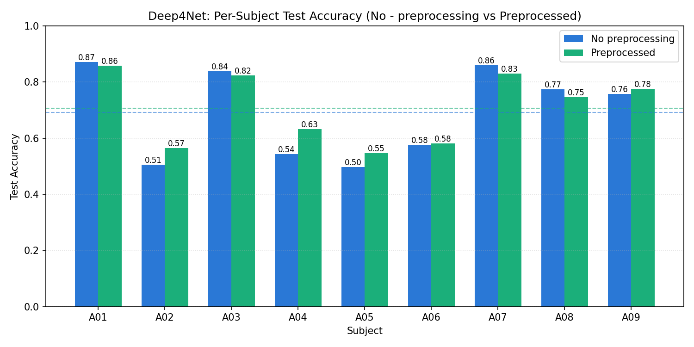
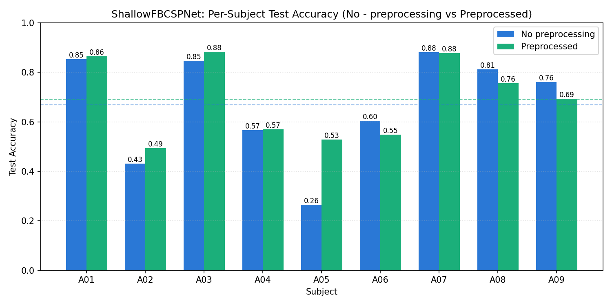
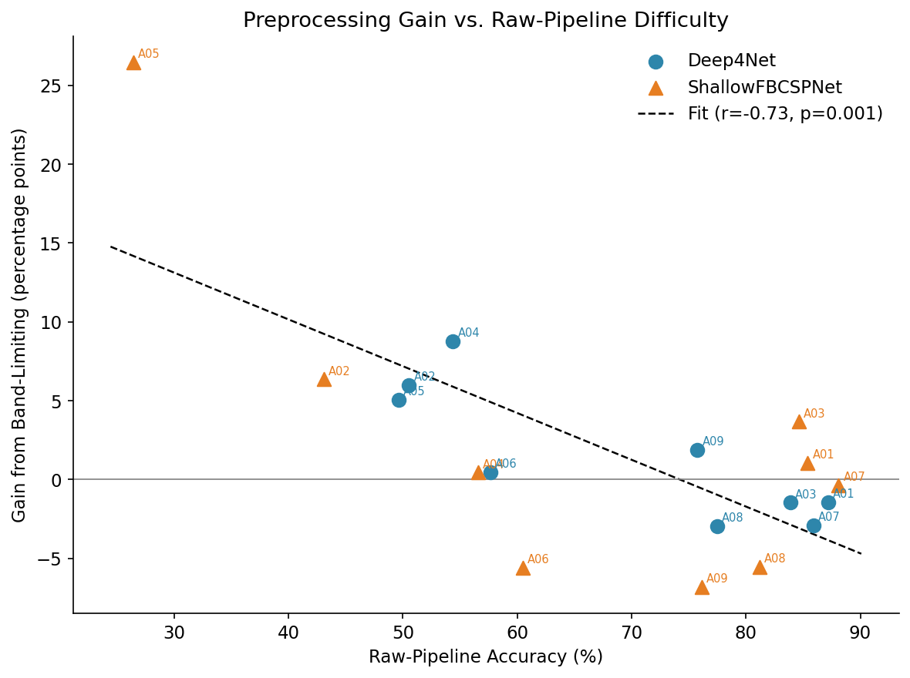
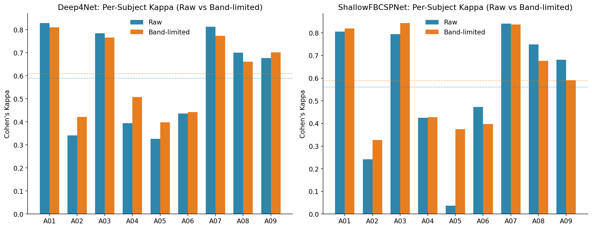
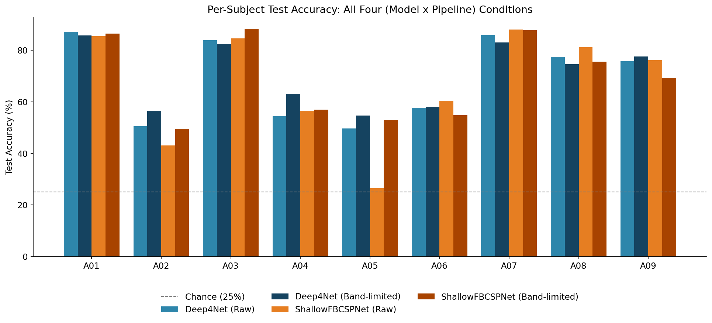
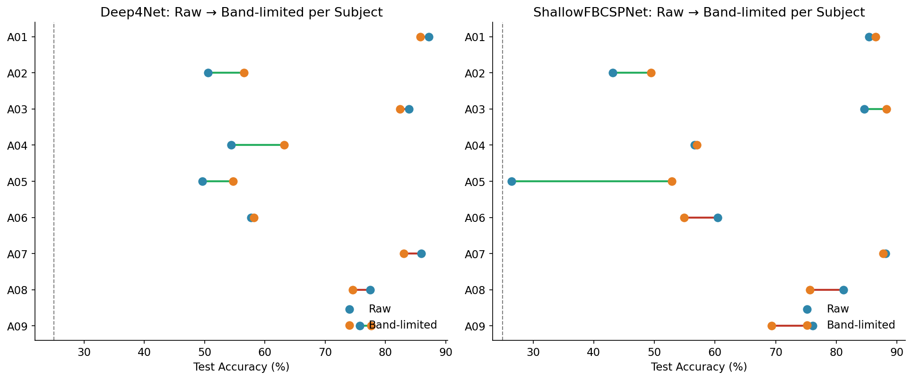

# EEG Motor Imagery Classification — Preprocessing & Deep Learning Comparison

Does signal preprocessing actually help deep learning models decode motor imagery EEG, or can CNNs learn everything they need directly from raw signals? This project tests that question under a strictly matched protocol on the BCI Competition IV 2a dataset, comparing two architectures (**Deep4Net** and **ShallowFBCSPNet**) each trained on two versions of the same trials — **No Preprocessing** (raw) and **Preprocessed** (band-limited: 8–30 Hz bandpass + 50 Hz notch + ICA artifact removal) — with everything else (cross-subject pretraining, per-subject fine-tuning, cropped-decision aggregation, hyperparameters) held identical, so any difference traces back to the input representation alone.

## Dataset

[BCI Competition IV 2a](https://www.bbci.de/competition/iv/#dataset2a) — 4-class motor imagery (left hand, right hand, feet, tongue), 9 subjects × 2 sessions (T = train, E = eval, recorded on different days), 22 EEG + 3 EOG channels, 250 Hz.

Preprocessed versions of the dataset (already epoched and labeled) are available on Kaggle:
- **Epoched + labeled (train-ready):** https://www.kaggle.com/datasets/moonimint/bci-iv-2a-epoched-with-labels
- **Raw GDF (no preprocessing):** https://www.kaggle.com/datasets/moonimint/bci-iv-2a-raw-gdf

> Original raw dataset can also be downloaded directly from the official source linked above. True labels for the evaluation (E) sessions — not embedded in the official GDF files — are available separately at `https://www.bbci.de/competition/iv/results/ds2a/true_labels.zip`.

## Pipeline

**Deep4Net pipeline** (includes Euclidean Alignment):


**ShallowFBCSPNet pipeline** (no Euclidean Alignment):


Two matched pipelines are built from the same trials; only the input representation differs between them.

1. **Load** raw `.gdf` files (MNE), rename generic channel labels to standard 10-20 names, apply standard 10-20 montage
2. **No Preprocessing branch:** epochs kept as-is, no frequency-domain processing
3. **Preprocessed branch:** epochs additionally pass through:
   - **Bandpass filter** — 8–30 Hz (covers mu/beta bands relevant to motor imagery ERD/ERS)
   - **Notch filter** — 50 Hz (powerline noise)
   - **ICA** — automatic EOG-correlated artifact component detection and removal
4. **Epoching** — 0–4s post-cue trial windows, rejected trials (dataset-flagged) dropped, E-session labels merged from the official true-labels release
5. **Euclidean Alignment** — per-subject covariance whitening to reduce cross-subject/session distribution shift (applied in the Deep4Net pipeline only; see Notes)
6. **Cropped training** — each trial split into overlapping 500-sample windows (stride 50) as temporal data augmentation; trials are split into train/validation **before** cropping to prevent window-leakage
7. **Cross-subject pretraining** — a single backbone is pretrained on the pooled cropped T-session data of all 9 subjects (Adam, cosine LR schedule, label smoothing, Mixup)
8. **Per-subject fine-tuning** — the pretrained weights are adapted to each subject's own T-session data at a low learning rate, refining rather than overwriting the shared representation
9. **Evaluation** — every crop of an E-session trial is scored, and crop-level predictions are aggregated into one trial-level prediction (majority vote / soft-pooling), reported as accuracy and Cohen's κ

All 18 subject/session files processed successfully across both pipelines.

## Models

- **Deep4Net** — a four-block deep CNN learning a hierarchy of spectral-spatial features directly from the time series (pipeline includes Euclidean Alignment)
- **ShallowFBCSPNet** — a shallow CNN whose squaring-and-log-pooling front end approximates classical Filter Bank Common Spatial Patterns band-power computation (pipeline trained without Euclidean Alignment)

> **Note on model selection:** EEGNet was attempted first but consistently produced near-chance performance on this dataset despite extensive tuning (learning rate, dropout, weight decay, sampling-rate-corrected kernel length). A within-session cross-validation diagnostic confirmed this was model-specific rather than a data/pipeline issue — a classical LDA baseline on the same data achieved kappa ≈ 0.46 cross-session. Deep4Net and ShallowFBCSPNet were adopted instead and both achieved literature-consistent results.

## Results

Per-subject test accuracy (%) on the held-out E session:

| Subject | Deep4Net (Preprocessed) | Deep4Net (No Preprocessing) | ShallowFBCSPNet (Preprocessed) | ShallowFBCSPNet (No Preprocessing) |
|---|---|---|---|---|
| A01 | 85.77 | 87.19 | 86.48 | 85.41 |
| A02 | 56.54 | 50.53 | 49.47 | 43.11 |
| A03 | 82.42 | 83.88 | 88.28 | 84.62 |
| A04 | 63.16 | 54.39 | 57.02 | 56.58 |
| A05 | 54.71 | 49.64 | 52.90 | 26.45 |
| A06 | 58.14 | 57.67 | 54.88 | 60.47 |
| A07 | 83.03 | 85.92 | 87.73 | 88.09 |
| A08 | 74.54 | 77.49 | 75.65 | 81.18 |
| A09 | 77.65 | 75.76 | 69.32 | 76.14 |

Full per-subject results (including Cohen's κ) are in [`results/per_subject_accuracy.csv`](results/per_subject_accuracy.csv). Aggregate (model × pipeline) summary statistics — mean, std, min, max accuracy and κ — are in [`results/model_results.csv`](results/model_results.csv).

### Key findings

- **Preprocessing gives a modest average gain**, consistent for both architectures (Deep4Net: 69.16% → 70.66%; ShallowFBCSPNet: 66.89% → 69.08%), but this mean difference is **not statistically significant** at n=9 (paired t-test, p=0.30 and p=0.53 respectively) — the sample size is simply too small to confirm a small mean shift.
- **The benefit is strongly concentrated on the hardest subjects.** Correlating each subject's no-preprocessing accuracy with their gain from preprocessing reveals a statistically significant negative relationship (pooled across both models: Pearson r = −0.726, **p = 0.0006**) — subjects who decode poorly without preprocessing are precisely the ones who benefit most from it. This is the most statistically robust finding of the study, and holds within each architecture individually.
- **Preprocessing reduces cross-subject variance** (ShallowFBCSPNet accuracy std: 20.40 → 15.11; worst-subject accuracy: 26.45% → 49.47%), though this variance reduction itself does not reach significance at this sample size.

### Charts

**Deep4Net per-subject accuracy (No Preprocessing vs. Preprocessed):**


**ShallowFBCSPNet per-subject accuracy (No Preprocessing vs. Preprocessed):**


**Accuracy gain vs. no-preprocessing difficulty** (headline result — subjects with the lowest no-preprocessing accuracy show the largest gains):


**Per-subject Cohen's κ, both models:**


**All four (model × pipeline) conditions per subject:**


**Per-subject shift from No Preprocessing → Preprocessed:**


## Status

- [x] Preprocessing pipeline built and validated (bandpass + notch + ICA)
- [x] No-preprocessing (raw) pipeline built as a matched control
- [x] Epoching, rejected-trial handling, E-session label merging
- [x] Euclidean Alignment (Deep4Net pipeline)
- [x] Cropped training + cross-subject pretraining + per-subject fine-tuning
- [x] Models: Deep4Net, ShallowFBCSPNet (EEGNet attempted, underperformed — see Notes)
- [x] Training + evaluation (accuracy, Cohen's κ) — all 9 subjects, both models, both conditions
- [x] Statistical analysis (paired t-test, Wilcoxon, effect sizes, gain-vs-difficulty correlation)
- [x] Results comparison and charts
- [x] Paper write-up

## Repo Structure

```
├── notebooks/
│   ├── EEG_with_pre-processing.ipynb      # preprocessing pipeline: bandpass + notch + ICA + epoching
│   ├── deep4net_preprocessed.ipynb        # Deep4Net training, preprocessed track
│   ├── deep4net_raw.ipynb                 # Deep4Net training, no-preprocessing track
│   ├── shallowfbcsp_preprocessed.ipynb    # ShallowFBCSPNet training, preprocessed track
│   └── shallowfbcsp_raw.ipynb             # ShallowFBCSPNet training, no-preprocessing track
├── pipeline/
│   ├── deep4net_pipeline.png
│   └── shallowfbcspnet_pipeline.png
├── charts/
│   ├── deep4net_raw_vs_preprocessed.png
│   ├── shallowfbcspnet_raw_vs_preprocessed.png
│   ├── figA_combined_4condition_accuracy.png
│   ├── figB_per_subject_kappa.png
│   ├── figC_gain_vs_difficulty_scatter.png
│   └── figD_dumbbell_raw_to_bandlimited.png
├── results/
│   ├── per_subject_accuracy.csv
│   └── model_results.csv
├── README.md
└── requirements.txt
```

## Requirements

```
mne
numpy
matplotlib
scikit-learn
scipy
pandas
torch
braindecode
```

## Notes

- Both pipelines (No Preprocessing / Preprocessed) use identical training hyperparameters (Adam, cosine LR schedule, weight decay 0.01, dropout 0.5, Mixup α=0.2, label smoothing 0.1, early stopping) so that the comparison isolates the effect of the input representation alone.
- Euclidean Alignment is applied only in the Deep4Net pipeline, not ShallowFBCSPNet — this means the *cross-architecture* comparison (Deep4Net vs. ShallowFBCSPNet) is confounded by alignment, while the *No-Preprocessing-vs-Preprocessed* comparison remains fully matched **within** each architecture. See the paper for full discussion of this design choice.
- Evaluation uses a cross-session protocol (train on session T, test on session E, recorded on a different day) rather than within-session cross-validation, which is a stricter and more realistic test of generalization — this is why absolute accuracies here are lower than some published results that use within-session splits.
